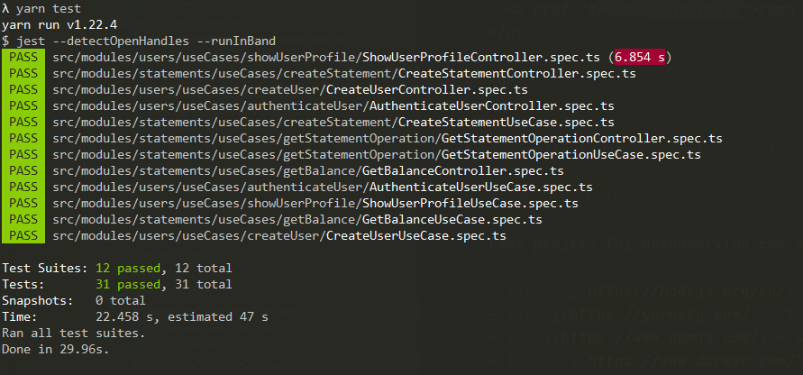
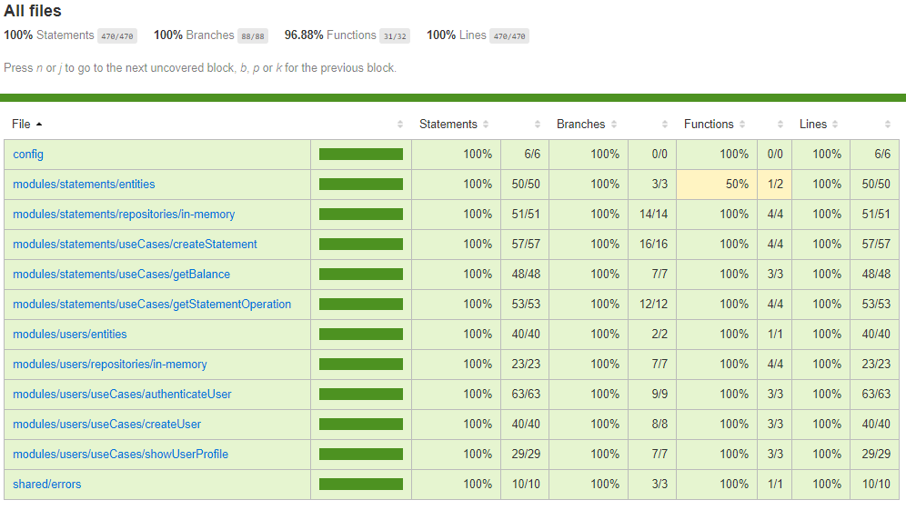

<p align="center">
  <a href="#rocket-tecnologias">Tecnologias</a>&nbsp;&nbsp;&nbsp;|&nbsp;&nbsp;&nbsp;
  <a href="#-projeto">Projeto</a>&nbsp;&nbsp;&nbsp;|&nbsp;&nbsp;&nbsp;
  <a href="#-como-rodar">Como rodar</a>&nbsp;&nbsp;&nbsp;|&nbsp;&nbsp;&nbsp;
  <a href="#-como-contribuir">Como contribuir</a>&nbsp;&nbsp;&nbsp;
</p>

<br>


## Ignite Node.js - Setimo desafio

## 🚀 Tecnologias

Esse projeto foi desenvolvido com as seguintes tecnologias:

- [NodeJS](https://nodejs.org/en/) - 0.63.3
- [Yarn](https://yarnpkg.com/) - 1.22.4
- [Npm](https://www.npmjs.com/) - 6.14.5
- [Docker](https://www.docker.com/) - 19.03.8
- [Potgres](https://www.postgresql.org/)

## 💻 Projeto

Projeto FinAPI é uma API que cadastrar usuarios e cria uma sessão do usuario para e mostra todas as operações financeiras desse usuario.
O objetivo é criar testes unitários e de integração para cobrir todo o codigo.

Descrição do desafio [Ignite](https://www.notion.so/Desafio-02-Testes-de-integra-o-70a8af48044d444cb1d2c1fa00056958)


Resolulção do teste.

<p align="center">
  
</p>

Cobertura dos testes

<p align="center">
  
</p>

## 🚀 Como Rodar

- Clone o projeto.
- Entre na pasta do projeto e rode "yarn install" (pode usar npm install de acordo com a sua configuração).
- Rode o comando para criar o Docker do Postgres:
```
docker run --name gostack_postgres -e POSTGRES_PASSWORD=docker -p 5432:5432 -d postgres
```
- crie um banco com o nome fin_api.
- No arquivo ormconfig.json altere o usuario e senha do banco de dados.
- Rode o docker do banco "docker start gostack_postgres".
- "yarn test" para rodar os testes.
- Para rodar a cobertura dos teste rode "yarn test --coverage".


## 🤔 Como contribuir

- Faça um fork desse repositório;
- Cria uma branch com a sua feature: `git checkout -b minha-feature`;
- Faça commit das suas alterações: `git commit -m 'feat: Minha nova feature'`;
- Faça push para a sua branch: `git push origin minha-feature`.

Depois que o merge da sua pull request for feito, você pode deletar a sua branch.

## 📝 Licença

Esse projeto está sob a licença MIT.
